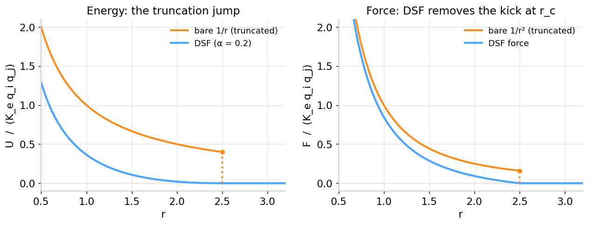
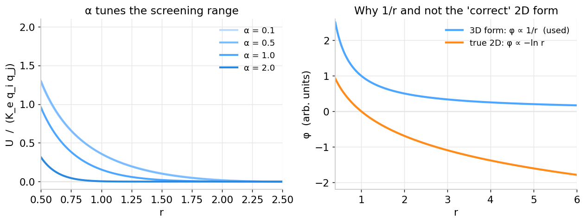

# DSF Electrostatics

> 💡 Charged particles in Mocktini interact through a **Damped Shifted Force (DSF)** electrostatic potential — a cutoff-friendly form of the Coulomb interaction. It is fully opt-in: with every charge at its default of 0, the term is simply skipped.

## The problem with cutting off Coulomb

The Mie potential is short-ranged: by the time you reach the cutoff $r_c$, it has nearly died away, so [shifting the energy](Mie-Potential#why-we-shift-it) is enough. Electrostatics is different. A bare Coulomb interaction falls off only as $1/r$, and its force as $1/r^2$ — both are **still sizeable at any reasonable cutoff**. Truncate it and every pair crossing $r_c$ gets a noticeable jump in *both* energy and force, which is poison for energy conservation.

The **Wolf / Damped-Shifted-Force** construction fixes this in two moves: a short-range **damping** (an `erfc` envelope set by $\alpha$) that makes the interaction decay faster, and a **shift of both the energy and the force** so each reaches exactly zero at $r_c$. The pair energy used by Mocktini is

$$U(r) = K_e\, q_i q_j\left[\frac{\mathop{\text{erfc}}(\alpha r)}{r} - \frac{\mathop{\text{erfc}}(\alpha r_c)}{r_c} + F_\text{shift}\,(r - r_c)\right]$$

with the shift constant evaluated once at the cutoff,

$$F_\text{shift} = \frac{\mathop{\text{erfc}}(\alpha r_c)}{r_c^{2}} + \frac{2\alpha}{\sqrt{\pi}}\,\frac{e^{-\alpha^2 r_c^2}}{r_c}.$$

The middle constant pins $U(r_c)=0$; the linear $F_\text{shift}(r-r_c)$ term pins the *force* to zero there too.

Two knobs control it:

- **$K_e$** — the linear Coulomb strength. Scales every electrostatic force and energy uniformly.
- **$\alpha$** — the DSF damping (an inverse screening length). This one is **non-linear**: small $\alpha$ approaches bare $1/r$ Coulomb (long-range), large $\alpha$ screens it heavily (short-range). It reshapes the interaction rather than just rescaling it.

```python
import numpy as np
import matplotlib.pyplot as plt
from scipy.special import erfc

BLUE, ORANGE = "#4da6ff", "#ff8c1a"
TWO_OVER_SQRT_PI = 2.0 / np.sqrt(np.pi)

def dsf_energy(r, alpha, rc=2.5):
    eshift = erfc(alpha*rc)/rc
    fshift = erfc(alpha*rc)/rc**2 + TWO_OVER_SQRT_PI*alpha*np.exp(-(alpha*rc)**2)/rc
    return erfc(alpha*r)/r - eshift + fshift*(r - rc)

def dsf_force(r, alpha, rc=2.5):
    fshift = erfc(alpha*rc)/rc**2 + TWO_OVER_SQRT_PI*alpha*np.exp(-(alpha*rc)**2)/rc
    return erfc(alpha*r)/r**2 + TWO_OVER_SQRT_PI*alpha*np.exp(-(alpha*r)**2)/r - fshift

r, rc, a = np.linspace(0.5, 3.2, 700), 2.5, 0.2
inside = r <= rc
fig, (a1, a2) = plt.subplots(1, 2, figsize=(10, 3.9))

a1.plot(r, np.where(inside, 1/r,  np.nan), color=ORANGE, lw=2.2, label="bare 1/r (truncated)")
a1.plot(r, np.where(inside, dsf_energy(r, a), 0), color=BLUE, lw=2.4, label="DSF (α = 0.2)")
a1.set_ylim(-0.1, 2.1); a1.set_xlabel("r"); a1.set_ylabel("U / (K_e q_i q_j)"); a1.legend()

a2.plot(r, np.where(inside, 1/r**2, np.nan), color=ORANGE, lw=2.2, label="bare 1/r² (truncated)")
a2.plot(r, np.where(inside, dsf_force(r, a), 0), color=BLUE, lw=2.4, label="DSF force")
a2.set_ylim(-0.1, 2.1); a2.set_xlabel("r"); a2.set_ylabel("F / (K_e q_i q_j)"); a2.legend()
plt.tight_layout(); plt.show()
```



*The orange curves are what plain truncation leaves behind — a step in both energy (left) and force (right) at $r_c$. DSF (blue) carries both smoothly to zero.*

## Tuning α, and a note on dimensionality

Sweeping $\alpha$ shows how the same charges can act long- or short-range. And the right panel below answers a question every careful reader asks: *why a $1/r$ potential in a 2D world?*

```python
fig, (a1, a2) = plt.subplots(1, 2, figsize=(10, 3.9))

# α family
r = np.linspace(0.5, 2.5, 500)
for alpha, col in zip([0.1, 0.5, 1.0, 2.0], ["#bcdcff", "#7bbcff", "#4da6ff", "#2a88e0"]):
    a1.plot(r, dsf_energy(r, alpha), color=col, lw=2.3, label=f"α = {alpha}")
a1.set_xlabel("r"); a1.set_ylabel("U / (K_e q_i q_j)"); a1.legend()

# 3D 1/r (used) vs true-2D logarithmic potential
r2 = np.linspace(0.4, 6.0, 600)
a2.plot(r2, 1/r2,        color="#4da6ff", lw=2.4, label="3D form: φ ∝ 1/r  (used)")
a2.plot(r2, -np.log(r2), color="#ff8c1a", lw=2.4, label="true 2D: φ ∝ −ln r")
a2.set_xlabel("r"); a2.set_ylabel("φ (arb. units)"); a2.legend()
plt.tight_layout(); plt.show()
```



The "physically correct" electrostatic potential of a point charge **in two dimensions** is not $1/r$ at all — solving the 2D Poisson equation gives a **logarithmic** potential, $\varphi \propto -\ln r$, with a force that falls off only as $1/r$. That is *even more long-ranged* than the 3D Coulomb interaction: the log potential never levels off — it keeps growing without bound as particles separate (orange, above), and its force decays more slowly than the 3D $1/r^2$.

Mocktini deliberately uses the familiar **3D form** ($\varphi \propto 1/r$) instead. The reasons are practical and perceptual: the true 2D logarithmic interaction is harder to handle and, frankly, looks strange to intuition built in a 3D world, where "Coulomb" *means* $1/r$. The $1/r$ form decays to something flat and recognisable, behaves well under a cutoff, and is a perfectly good **coarse model** for building intuition about charge — which is what Mocktini is for. We are borrowing 3D electrostatics into a 2D box on purpose, not claiming dimensional rigour.

<details>
<summary>🔬 <b>In depth</b> — limits, the force, and the neutrality assumption</summary>

*Sections marked 🔬 In depth go into the maths and trade-offs: handy if you work in the field, safe to skip otherwise.*

**Force.** The magnitude along $\hat{\mathbf r}$ is

$$F(r) = K_e\,q_i q_j\left[\frac{\mathop{\text{erfc}}(\alpha r)}{r^{2}} + \frac{2\alpha}{\sqrt{\pi}}\frac{e^{-\alpha^2 r^2}}{r} - F_\text{shift}\right],$$

and you can check directly that $U(r_c)=0$ and $F(r_c)=0$ — both the constant and the linear term are built so the bracket vanishes at the cutoff.

**The $\alpha \to 0$ limit.** Since $\mathop{\text{erfc}}(0)=1$, the damping disappears and $F_\text{shift}\to 1/r_c^2$, recovering the plain **shifted-force Coulomb** (the Wolf method without damping).

**`erfc`.** Both the CPU and GPU engines evaluate `erfc` with the same Abramowitz & Stegun 7.1.26 rational approximation (error $\le 1.5\times10^{-7}$), so the two backends agree to floating-point precision.

</details>

**Neutrality.** DSF, like every cutoff-based electrostatics method, assumes the box is **net-neutral**. A non-zero total charge $\sum_i q_i$ introduces a spurious self-interaction. The live stats bar reports $\Sigma q$ so you can keep it at zero.

## In Mocktini

| Control | Symbol | Where | Default |
|---|---|---|---|
| Coulomb strength | $K_e$ | Electrostatics (DSF) panel | 5.0 |
| DSF damping | $\alpha$ | Electrostatics (DSF) panel | 1.0 |
| Per-bead charge | $q$ | Particle mode (inspect bar) / Polymer editor | 0 |

Charges are a **per-particle** property (not per type): set them on individual beads in Particle mode, or per bead in the polymer editor. The **Charge** colour mode renders them on a diverging blue → grey → red scale. Bonded and angle-sharing pairs are [excluded](Bonded-Interactions) from electrostatics just as they are from the Mie term.

---

📖 Related: [The Mie potential](Mie-Potential) · [Bonded interactions](Bonded-Interactions) · [Integrators](Integrators)
